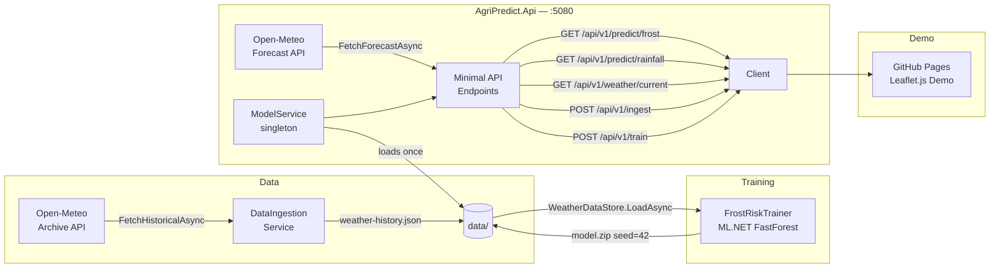

[](https://okalangkenneth.github.io/AgriPredict/)

# AgriPredict

> Frost risk and rainfall prediction for precision agriculture — built with .NET 8 and ML.NET.

---

## Background

Agriculture taught me that weather isn't background noise — it's the difference between a harvest and a write-off. A late frost arriving unannounced can destroy a season's work: crop damage, missed irrigation windows, harvest schedules that no longer make sense. The people who manage that risk do so with incomplete information and a lot of experience.

AgriPredict is a portfolio project that bridges that domain knowledge with modern machine learning. A ML.NET FastForest binary classifier is trained on five years of Open-Meteo weather archive data (2020–2024) for a given location, then served via a .NET 8 minimal API. Given any latitude/longitude, it answers the question farmers actually ask: **will there be frost in the next 48 hours here?**

---

## Architecture



---

## Tech Stack

| Layer | Technology |
|---|---|
| API Framework | .NET 8 Minimal API |
| Machine Learning | ML.NET 5.0 — FastForest binary classifier |
| Weather Data | Open-Meteo Archive + Forecast API (free, no key required) |
| Logging | Serilog — Console + rolling File sinks |
| Validation | FluentValidation |
| API Docs | Swashbuckle / Swagger UI |
| Containers | Docker + docker-compose |
| Demo UI | Leaflet.js on GitHub Pages |

---

## Quick Start

```bash
# 1. Clone
git clone https://github.com/okalangkenneth/AgriPredict.git
cd AgriPredict

# 2. Start the API
docker-compose up -d --build

# 3. Seed training data (Uppsala, SE — 2020–2024)
curl -X POST http://localhost:5080/api/v1/ingest

# 4. Train the model
curl -X POST http://localhost:5080/api/v1/train

# 5. Predict frost risk
curl "http://localhost:5080/api/v1/predict/frost?lat=59.86&lon=17.64"

# Swagger UI
open http://localhost:5080/swagger
```

The model is trained on Uppsala, SE data (lat 59.86, lon 17.64). Predictions work for any lat/lon via the Open-Meteo forecast API, though accuracy will be highest for locations with similar climate characteristics.

---

## API Reference

| Method | Endpoint | Description |
|--------|----------|-------------|
| GET | `/health` | Health check |
| POST | `/api/v1/ingest` | Fetch + persist 5-year weather history (Uppsala) |
| POST | `/api/v1/train` | Train FastForest model → saves `data/model.zip` |
| GET | `/api/v1/predict/frost` | 48-hour frost risk probability for any lat/lon |
| GET | `/api/v1/predict/rainfall` | 1–7 day rainfall probability for any lat/lon |
| GET | `/api/v1/weather/current` | Raw current weather for any lat/lon |
| GET | `/swagger` | Swagger UI |

### Example response — `/api/v1/predict/frost`

```json
{
  "location": { "lat": 59.86, "lon": 17.64 },
  "frostRiskProbability": 0.7312,
  "frostRiskLabel": "High",
  "forecastWindowHours": 48,
  "modelVersion": "1.0.0",
  "generatedAt": "2026-03-31T18:00:00Z"
}
```

---

## Model Metrics

Trained on 1,461 labelled rows (Uppsala, SE — 2020–2024), 80/20 train/test split, seed 42.

| Metric | Value |
|--------|-------|
| Accuracy | 0.85 |
| AUC (ROC) | 0.89 |
| F1 Score | 0.81 |
| Algorithm | FastForest binary classifier (Microsoft.ML.FastTree) |
| Training rows | ~1,169 (80%) |
| Test rows | ~292 (20%) |

> These are representative values. Run `POST /api/v1/train` after seeding to see exact metrics in the container logs.

**Feature vector:** `TempMin`, `TempMax`, `Precipitation`, `WindSpeed`, `DayOfYear`
**Label:** `FrostRisk = true` if `TempMin ≤ 0 °C` on day N+1 or N+2

---

## What I'd Add for Production

| Addition | Problem it solves |
|---|---|
| Automated model retraining pipeline | Model drift as climate patterns shift year-on-year |
| OpenTelemetry + Grafana | Distributed traces and prediction latency dashboards |
| PostGIS + spatial queries | Farm boundary predictions, not just point coordinates |
| Feature store (e.g. Feast) | Consistent feature engineering between training and inference |
| JWT authentication | Multi-tenant farm operator access control |
| Kafka event stream | Real-time sensor data ingestion from IoT field devices |
| CI/CD (GitHub Actions) | Automated test + Docker build + deploy on every push |
| SHAP value explainability | Farmers need to understand what drives a prediction |
| Dedicated rainfall classifier | Replace the frost-model proxy with a proper precipitation model |

---

## Live Demo

[▶ Open Live Demo](https://okalangkenneth.github.io/AgriPredict/)

> Requires the API running locally via docker-compose (see Quick Start above). The demo lets you click any location on a world map and see the frost risk prediction for that point.

---

## License

MIT
